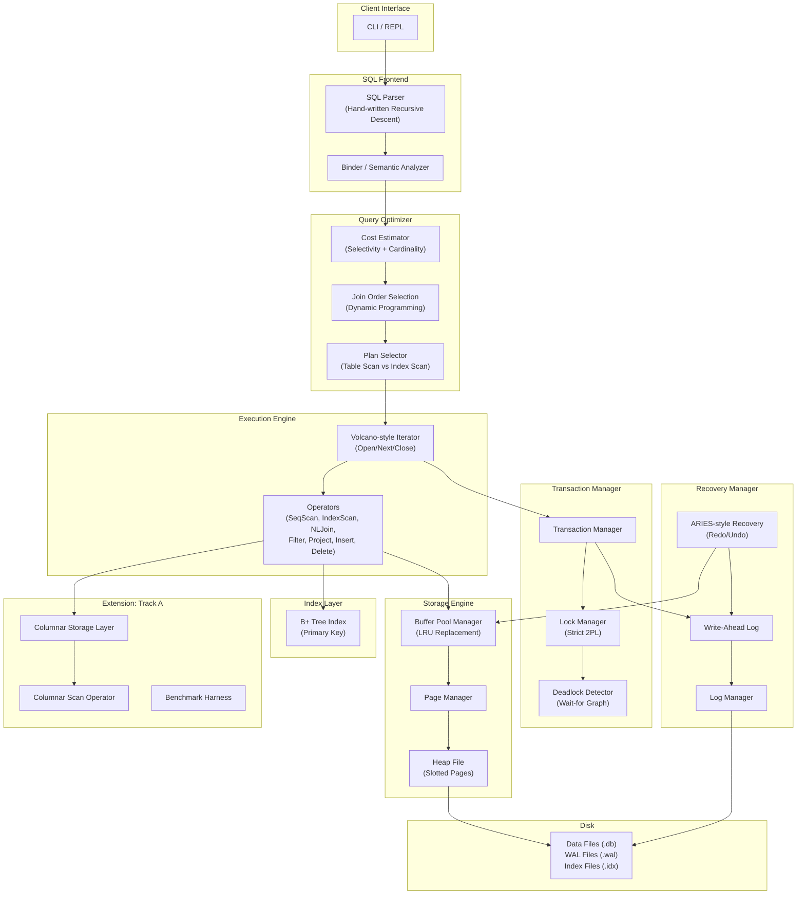

# MiniDB — Capstone Implementation Plan

A fully functional relational database engine built from scratch in **C++17** with **CMake**.

**Extension Track chosen: Track A — Performance (Columnar Storage Layer)**

---

## Why Track A?

| Track | Risk | Complexity | Ease of Benchmarking | Verdict |
|-------|------|------------|---------------------|---------|
| A — Performance (Columnar) | Low — additive, doesn't replace core | Medium | ✅ Easy before/after comparison | **Best pick** |
| B — Concurrency (MVCC) | High — replaces 2PL (a core component) | High | Moderate | Risky |
| C — Modern Storage (LSM) | High — replaces heap files (a core component) | High | Moderate | Risky |
| D — Distributed | Medium — networking complexity | Very High | Hard to demo reliably | Overkill |

Track A is **additive**: we build the full row-store core first, then add a columnar storage layer *alongside* it. We get easy, impressive benchmarks (row-store vs columnar for scans/aggregations), and it doesn't risk breaking the core system.

---

## System Architecture



---

## Project Directory Structure

```
project/
├── CMakeLists.txt                    # Root CMake configuration
├── README.md                         # Project documentation
├── src/
│   ├── CMakeLists.txt
│   ├── main.cpp                      # Entry point (REPL)
│   │
│   ├── common/
│   │   ├── config.h                  # Constants (PAGE_SIZE, POOL_SIZE, etc.)
│   │   ├── types.h                   # Type aliases (page_id_t, txn_id_t, etc.)
│   │   ├── rid.h                     # Record ID (page_id + slot_num)
│   │   └── status.h                  # Error/Status codes
│   │
│   ├── storage/
│   │   ├── page.h / page.cpp         # Page layout (slotted page)
│   │   ├── heap_file.h / .cpp        # Heap file manager
│   │   ├── page_manager.h / .cpp     # Disk I/O (read/write pages)
│   │   └── buffer_pool.h / .cpp      # Buffer pool with LRU
│   │
│   ├── index/
│   │   ├── b_plus_tree.h / .cpp      # B+ Tree implementation
│   │   ├── b_plus_tree_node.h        # Internal + Leaf node structures
│   │   └── index_manager.h / .cpp    # Index catalog & lifecycle
│   │
│   ├── catalog/
│   │   ├── schema.h                  # Table schema (columns, types)
│   │   ├── table_info.h              # Table metadata
│   │   └── catalog.h / .cpp          # System catalog (table registry)
│   │
│   ├── sql/
│   │   ├── lexer.h / lexer.cpp       # SQL Tokenizer
│   │   ├── parser.h / parser.cpp     # Recursive descent parser
│   │   ├── ast.h                     # AST node definitions
│   │   └── binder.h / binder.cpp     # Semantic analysis / binding
│   │
│   ├── optimizer/
│   │   ├── stats.h / stats.cpp       # Table statistics (row count, distinct values)
│   │   ├── cost_model.h / .cpp       # Cost estimation formulas
│   │   └── optimizer.h / .cpp        # Plan enumeration + selection
│   │
│   ├── execution/
│   │   ├── executor.h                # Base executor interface (Open/Next/Close)
│   │   ├── seq_scan.h / .cpp         # Sequential scan
│   │   ├── index_scan.h / .cpp       # Index scan via B+ Tree
│   │   ├── filter.h / .cpp           # WHERE clause filter
│   │   ├── projection.h / .cpp       # Column projection
│   │   ├── nested_loop_join.h / .cpp # Nested loop join
│   │   ├── insert_executor.h / .cpp  # INSERT execution
│   │   ├── delete_executor.h / .cpp  # DELETE execution
│   │   └── executor_factory.h / .cpp # Build executor tree from plan
│   │
│   ├── txn/
│   │   ├── transaction.h / .cpp      # Transaction state
│   │   ├── txn_manager.h / .cpp      # Begin/Commit/Abort
│   │   ├── lock_manager.h / .cpp     # Lock table (Strict 2PL)
│   │   └── deadlock_detector.h / .cpp# Wait-for graph cycle detection
│   │
│   ├── recovery/
│   │   ├── log_record.h              # Log record types (Insert/Delete/Commit/Abort/CLR)
│   │   ├── log_manager.h / .cpp      # WAL write + flush
│   │   └── recovery_manager.h / .cpp # ARIES: Analysis → Redo → Undo
│   │
│   └── extension/
│       ├── columnar_store.h / .cpp   # Column-oriented storage
│       ├── columnar_scan.h / .cpp    # Columnar scan executor
│       └── col_converter.h / .cpp    # Row-to-column converter
│
├── benchmarks/
│   ├── CMakeLists.txt
│   ├── benchmark_main.cpp            # Benchmark harness
│   ├── bench_storage.cpp             # Storage layer benchmarks
│   ├── bench_index.cpp               # B+ Tree benchmarks
│   ├── bench_query.cpp               # Query execution benchmarks
│   └── bench_columnar.cpp            # Row-store vs Columnar comparison
│
├── tests/
│   ├── CMakeLists.txt
│   ├── test_page.cpp
│   ├── test_buffer_pool.cpp
│   ├── test_btree.cpp
│   ├── test_parser.cpp
│   ├── test_executor.cpp
│   ├── test_txn.cpp
│   └── test_recovery.cpp
│
└── docs/
    ├── architecture.md               # Detailed architecture doc
    └── benchmarks.md                  # Benchmark results & analysis
```

---

## Proposed Changes — Phase by Phase

### Phase 1: Project Scaffolding & Common Types

#### [NEW] CMakeLists.txt (root)
- C++17 standard, project name `minidb`
- Subdirectories: `src`, `tests`, `benchmarks`
- Enable testing with CTest
- Use GoogleTest for unit tests (fetched via `FetchContent`)

#### [NEW] src/CMakeLists.txt
- Build `minidb_lib` static library from all source files
- Build `minidb` executable from `main.cpp` linked to `minidb_lib`

#### [NEW] src/common/config.h
- `PAGE_SIZE = 4096` bytes
- `BUFFER_POOL_SIZE = 1024` pages
- `B_PLUS_TREE_ORDER = 128`
- `MAX_RECORD_SIZE = PAGE_SIZE - 64` (header overhead)

#### [NEW] src/common/types.h
- `page_id_t` (uint32_t) — page identifier
- `frame_id_t` (uint32_t) — buffer pool frame
- `txn_id_t` (uint64_t) — transaction ID
- `lsn_t` (uint64_t) — log sequence number
- `slot_num_t` (uint16_t) — slot within a page
- Column types enum: `INT`, `FLOAT`, `VARCHAR`, `BOOL`

#### [NEW] src/common/rid.h
- `RID` struct: `{page_id, slot_num}` — uniquely identifies a record on disk

#### [NEW] src/common/status.h
- `Status` class with error codes: `OK`, `NOT_FOUND`, `DUPLICATE_KEY`, `OUT_OF_MEMORY`, `IO_ERROR`, `DEADLOCK`, `TXN_ABORT`

---

### Phase 2: Storage Engine

> [!IMPORTANT]
> This is the foundation — everything else depends on this being correct.

#### [NEW] src/storage/page.h / page.cpp — Slotted Page
- **Header**: page_id, num_slots, free_space_offset, LSN
- **Slot directory**: array of `(offset, length)` pairs growing from the front
- **Records**: variable-length, packed from the end of the page
- Methods: `InsertRecord(data) → slot_num`, `DeleteRecord(slot_num)`, `GetRecord(slot_num) → data`, `UpdateRecord(slot_num, data)`

#### [NEW] src/storage/page_manager.h / .cpp — Disk I/O
- Manages raw file I/O for `.db` data files
- `ReadPage(page_id, data_buf)` — reads 4KB page from disk
- `WritePage(page_id, data_buf)` — writes 4KB page to disk
- `AllocatePage() → page_id` — extends file, returns new page ID
- Tracks total pages allocated

#### [NEW] src/storage/heap_file.h / .cpp — Heap File Manager
- Owns a `PageManager` and organizes pages as a heap (linked list of pages with free space)
- `InsertRecord(record) → RID`
- `DeleteRecord(rid)`
- `GetRecord(rid) → record`
- `Scan() → iterator over all records`
- Maintains a **free page list** for efficient insertion

#### [NEW] src/storage/buffer_pool.h / .cpp — Buffer Pool with LRU
- Fixed-size pool of in-memory page frames
- `FetchPage(page_id) → Page*` — returns pinned page (from pool or disk)
- `UnpinPage(page_id, is_dirty)` — decrements pin count, marks dirty
- `FlushPage(page_id)` — writes dirty page to disk
- `FlushAllPages()` — for checkpoint/shutdown
- **LRU replacement policy**: evicts least-recently-used unpinned page when pool is full
- Pin count tracking to prevent eviction of in-use pages

---

### Phase 3: Catalog & B+ Tree Indexing

#### [NEW] src/catalog/schema.h
- `Column`: name, type, size, is_primary_key, is_nullable
- `Schema`: vector of columns, primary key column index

#### [NEW] src/catalog/table_info.h
- `TableInfo`: table_name, schema, heap_file_id, index_ids, row_count

#### [NEW] src/catalog/catalog.h / .cpp
- System catalog: `CreateTable(name, schema)`, `DropTable(name)`, `GetTable(name) → TableInfo`
- Stores metadata in a special system table (or serialized to a catalog file)
- Tracks all tables and their associated indexes

#### [NEW] src/index/b_plus_tree_node.h
- `BPlusTreeNode` base with `is_leaf`, `num_keys`, `keys[]`
- `InternalNode`: child pointers (page_ids)
- `LeafNode`: values (RIDs), `next_leaf` pointer for range scans

#### [NEW] src/index/b_plus_tree.h / .cpp
- Parameterized by key type (int for primary keys)
- `Insert(key, rid)` — with node splitting
- `Delete(key)` — with node merging/redistribution
- `Search(key) → RID` — point lookup
- `RangeScan(low, high) → vector<RID>` — leaf-level scan using next pointers
- Uses the Buffer Pool for all page access (not raw disk I/O)

#### [NEW] src/index/index_manager.h / .cpp
- `CreateIndex(table_name, column_name) → index_id`
- `GetIndex(table_name, column_name) → BPlusTree*`
- Manages lifecycle of B+ Tree instances

---

### Phase 4: SQL Frontend (Parser + Binder)

#### [NEW] src/sql/lexer.h / lexer.cpp — Tokenizer
Supported tokens:
- Keywords: `SELECT`, `FROM`, `WHERE`, `INSERT`, `INTO`, `VALUES`, `DELETE`, `CREATE`, `TABLE`, `JOIN`, `ON`, `AND`, `OR`, `NOT`, `INT`, `FLOAT`, `VARCHAR`, `BOOL`
- Operators: `=`, `<`, `>`, `<=`, `>=`, `!=`, `*`, `,`, `(`, `)`, `;`
- Literals: integers, floats, strings (single-quoted)
- Identifiers: table/column names

#### [NEW] src/sql/ast.h — AST Nodes
- `CreateTableStmt`: table_name, column_defs
- `InsertStmt`: table_name, values_list
- `DeleteStmt`: table_name, where_clause
- `SelectStmt`: select_list, from_tables, join_clause, where_clause
- `Expression`: column_ref, literal, binary_op (comparison, AND/OR)
- `JoinClause`: table_name, on_condition

#### [NEW] src/sql/parser.h / parser.cpp — Recursive Descent Parser
- `Parse(sql_string) → ASTNode`
- Grammar rules for each statement type
- Error reporting with line/column info

Supported SQL:
```sql
CREATE TABLE t (id INT PRIMARY KEY, name VARCHAR(255), age INT);
INSERT INTO t VALUES (1, 'Alice', 30);
SELECT * FROM t WHERE age > 25;
SELECT t1.name, t2.name FROM t1 JOIN t2 ON t1.id = t2.id WHERE t1.age > 20;
DELETE FROM t WHERE id = 1;
```

#### [NEW] src/sql/binder.h / binder.cpp — Semantic Analysis
- Resolves table names against catalog
- Resolves column references against schemas
- Type checking for comparisons
- Produces a bound/annotated AST

---

### Phase 5: Query Optimizer & Execution Engine

#### [NEW] src/optimizer/stats.h / stats.cpp — Table Statistics
- `TableStats`: row_count, distinct_values per column, min/max per column
- Updated on insert/delete (simple counters)
- Used by cost model for selectivity estimation

#### [NEW] src/optimizer/cost_model.h / .cpp
- Selectivity estimation:
  - Equality: `1 / distinct_values`
  - Range: `(high - low) / (max - min)`
  - Default: `0.1` for unknown predicates
- Cost formulas:
  - Sequential scan cost = `num_pages`
  - Index scan cost = `height + selectivity * num_pages`
  - Nested loop join cost = `outer_pages + outer_rows * inner_cost`
- Choose table scan vs index scan based on cost

#### [NEW] src/optimizer/optimizer.h / .cpp
- Takes bound AST, produces a physical query plan (tree of executor nodes)
- **Join order selection**: dynamic programming for 2-3 table joins (enumerate all orderings, pick cheapest)
- **Access path selection**: for each table, choose seq scan or index scan
- Outputs an execution plan tree

#### [NEW] src/execution/executor.h — Base Interface
```cpp
class Executor {
public:
    virtual void Open() = 0;
    virtual bool Next(Tuple* tuple) = 0;  // Volcano-style
    virtual void Close() = 0;
};
```

#### [NEW] src/execution/seq_scan.h / .cpp
- Iterates over all records in a heap file
- Applies optional filter predicate

#### [NEW] src/execution/index_scan.h / .cpp
- Uses B+ Tree to find matching RIDs, then fetches records

#### [NEW] src/execution/filter.h / .cpp
- Evaluates WHERE clause predicates on tuples

#### [NEW] src/execution/projection.h / .cpp
- Projects specified columns from input tuples

#### [NEW] src/execution/nested_loop_join.h / .cpp
- Simple nested loop join: for each outer tuple, scan inner
- Evaluates join condition

#### [NEW] src/execution/insert_executor.h / .cpp
- Inserts tuple into heap file + updates B+ Tree index

#### [NEW] src/execution/delete_executor.h / .cpp
- Deletes tuple from heap file + removes from B+ Tree index

#### [NEW] src/execution/executor_factory.h / .cpp
- Converts optimizer plan tree → executor tree

---

### Phase 6: Transaction Management & Recovery

#### [NEW] src/txn/transaction.h / .cpp
- `Transaction` class: txn_id, state (GROWING/SHRINKING/COMMITTED/ABORTED), write_set, lock_set
- States follow Strict 2PL protocol

#### [NEW] src/txn/lock_manager.h / .cpp
- Lock table: maps `RID → lock_info (mode, holders, wait_queue)`
- Lock modes: `SHARED`, `EXCLUSIVE`
- `LockShared(txn, rid)`, `LockExclusive(txn, rid)`, `Unlock(txn, rid)`
- Blocks on conflict; wakes up waiters on release
- Uses `std::mutex` + `std::condition_variable` for thread safety

#### [NEW] src/txn/txn_manager.h / .cpp
- `Begin() → txn_id` — starts a new transaction
- `Commit(txn_id)` — releases all locks, writes commit log record
- `Abort(txn_id)` — undoes changes using write set, releases locks

#### [NEW] src/txn/deadlock_detector.h / .cpp
- **Wait-for graph**: directed graph of txn_id → txn_id (who is waiting for whom)
- Periodically checks for cycles (DFS)
- On deadlock: aborts the youngest transaction

#### [NEW] src/recovery/log_record.h
- Log record types: `BEGIN`, `INSERT`, `DELETE`, `UPDATE`, `COMMIT`, `ABORT`, `CLR` (Compensation), `CHECKPOINT`
- Each record: LSN, txn_id, prev_LSN, type, before_image, after_image

#### [NEW] src/recovery/log_manager.h / .cpp
- Appends log records to WAL file sequentially
- `AppendLog(record) → LSN`
- `Flush(lsn)` — force-write WAL up to given LSN (for WAL protocol: flush before dirty page write)
- Group commit optimization (optional)

#### [NEW] src/recovery/recovery_manager.h / .cpp
- **ARIES-inspired** 3-phase recovery:
  1. **Analysis**: scan log forward, build active txn table + dirty page table
  2. **Redo**: replay all logged changes from oldest dirty page LSN
  3. **Undo**: rollback all uncommitted transactions using before-images
- Invoked on startup if unclean shutdown detected

---

### Phase 7: Extension Track A — Columnar Storage

#### [NEW] src/extension/columnar_store.h / .cpp
- Stores each column of a table as a separate file (one file per column)
- Column file format: fixed-size values packed contiguously (int = 4 bytes each, float = 8 bytes each)
- For VARCHAR: offset array + data blob
- Methods:
  - `CreateColumnStore(table_name, schema)` — creates column files from schema
  - `LoadFromHeap(heap_file)` — bulk converts row-store data to columnar format
  - `ScanColumn(column_id) → column_data` — reads entire column into memory
  - `ScanColumns(column_ids) → vector<column_data>` — reads multiple columns

#### [NEW] src/extension/columnar_scan.h / .cpp
- An executor that reads from columnar storage instead of heap files
- Implements the same `Open/Next/Close` interface
- Processes data in vectors/batches (e.g., 1024 values at a time)
- Evaluates filters column-at-a-time (late materialization)

#### [NEW] src/extension/col_converter.h / .cpp
- Utility to convert row-store heap files to columnar format
- Used for benchmarking: load same data into both formats, compare performance

---

### Phase 8: Benchmarking, Tests & Documentation

#### [NEW] benchmarks/benchmark_main.cpp
- Benchmark harness using `<chrono>` for timing
- Measures: latency (ms), throughput (ops/sec), memory usage

#### [NEW] benchmarks/bench_storage.cpp
- Random page read/write latency
- Buffer pool hit rate under varying workloads

#### [NEW] benchmarks/bench_index.cpp
- B+ Tree insert/search/delete throughput
- Range scan performance vs dataset size

#### [NEW] benchmarks/bench_query.cpp
- Full SELECT query latency (with and without indexes)
- JOIN performance with varying table sizes

#### [NEW] benchmarks/bench_columnar.cpp — **Extension Track A**
- **Row-store vs Columnar comparison**:
  - Full table scan (SELECT * FROM t): row-store should be comparable
  - Column projection (SELECT col1 FROM t): columnar should win
  - Aggregation (SUM, COUNT): columnar should significantly outperform
  - Filter + projection (SELECT col1 FROM t WHERE col2 > X): columnar advantage
- Vary dataset sizes: 10K, 100K, 1M rows
- Output CSV results for charting

#### [NEW] tests/ — Unit Tests (GoogleTest)
- `test_page.cpp`: insert/delete/get records on a slotted page
- `test_buffer_pool.cpp`: fetch/unpin/eviction/dirty page flush
- `test_btree.cpp`: insert/search/delete/range scan
- `test_parser.cpp`: parse SQL strings, verify AST
- `test_executor.cpp`: end-to-end query execution
- `test_txn.cpp`: concurrent transactions, lock conflicts, deadlock detection
- `test_recovery.cpp`: crash simulation + recovery verification

#### [NEW] README.md
- All 12 sections as required by the assignment
- Architecture diagram (Mermaid)
- Build & run instructions
- Benchmark results with charts

#### [NEW] docs/architecture.md
- Detailed module descriptions
- Design decisions and trade-offs

#### [NEW] docs/benchmarks.md
- Experimental setup
- Results tables and analysis
- Row-store vs Columnar comparison

---

## Implementation Schedule

| Phase | Component | Estimated Effort | Dependencies |
|-------|-----------|-----------------|--------------|
| 1 | Scaffolding + Common Types | ~30 min | None |
| 2 | Storage Engine (Page, Heap File, Buffer Pool) | ~2-3 hours | Phase 1 |
| 3 | Catalog + B+ Tree | ~2-3 hours | Phase 2 |
| 4 | SQL Parser + Binder | ~2-3 hours | Phase 3 |
| 5 | Optimizer + Execution Engine | ~3-4 hours | Phase 4 |
| 6 | Transactions + Recovery | ~3-4 hours | Phase 5 |
| 7 | Extension: Columnar Storage | ~2-3 hours | Phase 2 |
| 8 | Benchmarks, Tests, Documentation | ~2-3 hours | All phases |

**Total estimated: ~18-24 hours of implementation**

---

## Verification Plan

### Automated Tests
```bash
cd project && mkdir build && cd build
cmake .. -DCMAKE_BUILD_TYPE=Debug
make -j$(nproc)
ctest --output-on-failure
```

### Manual Verification
- **Storage**: Insert records, restart system, verify data persists
- **B+ Tree**: Insert 10K keys, verify all searchable, delete subset, verify
- **SQL**: Execute all supported SQL statement types via REPL
- **Optimizer**: Show that index scan is chosen for selective queries
- **Transactions**: Run concurrent transactions from multiple threads, verify serializability
- **Deadlock**: Create two transactions that deadlock, verify one is aborted
- **Recovery**: Insert data, simulate crash (kill process), restart, verify committed data survives
- **Columnar**: Run same analytical queries on row-store vs columnar, compare timings

### Benchmark Verification
```bash
./benchmarks/minidb_bench
```
- Generates CSV output for all benchmarks
- Verify row-store vs columnar performance difference is visible and significant for analytical queries

---

## Open Questions

> [!IMPORTANT]
> **Team Name**: What is your team name? This is needed for the PR title (`TEAM_<TEAM_NAME>`) and directory structure.

> [!IMPORTANT]
> **Team Members**: Please provide the full names, Scaler email IDs, and roll numbers of all team members for the README and PR description.

> [!NOTE]
> **Threading for Transactions**: The assignment requires demonstrating concurrent transactions. I plan to use `std::thread` with a thread pool for simulating concurrent clients. Is that acceptable, or do you prefer a different approach (e.g., forked processes, async I/O)?

> [!NOTE]
> **Deadline Awareness**: The deadline is **23 June 2026 (11:59 PM IST)** — which is tomorrow. Given the scope, I'll prioritize getting a working core system with clean architecture over extensive optimization. Are there specific features you consider most critical to have working for the demo?
